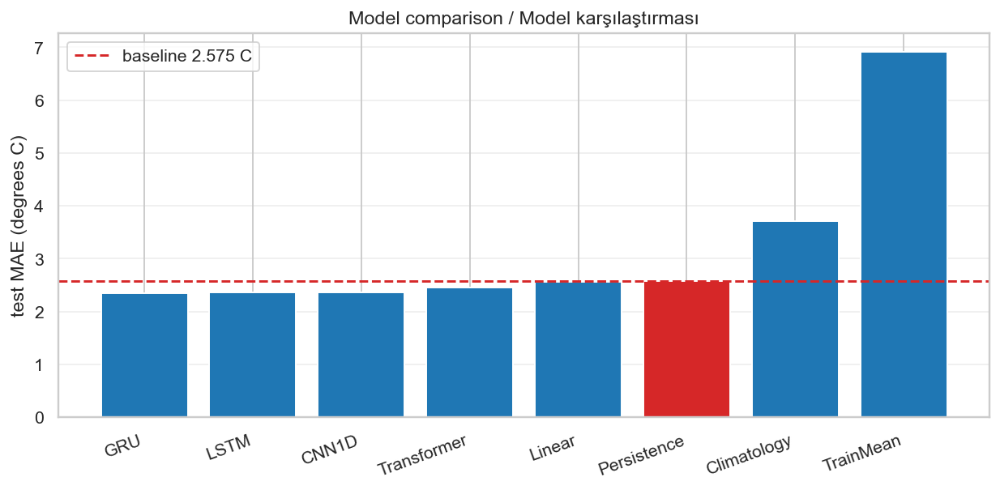
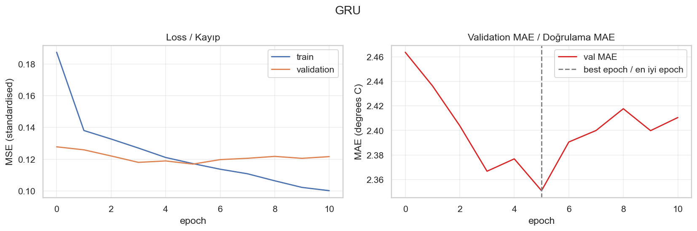
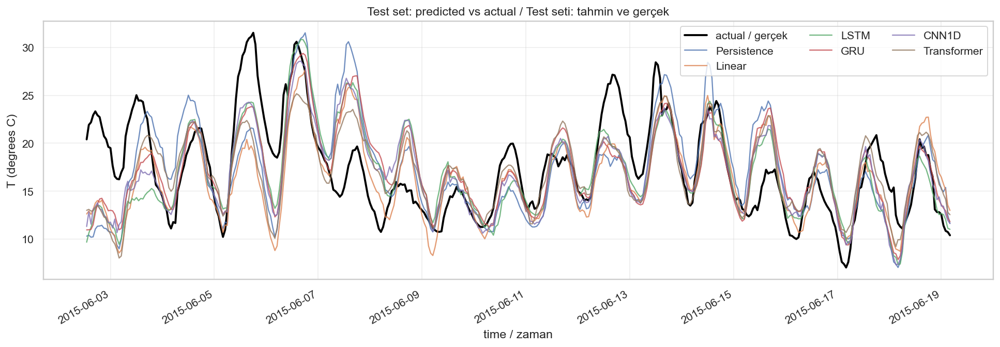

# Jena Climate — Temperature Forecasting with Deep Learning
# Jena İklim — Derin Öğrenme ile Sıcaklık Tahmini

**EN —** I built temperature forecasters on the Jena Climate dataset (2009–2016, a weather
station near Jena, Germany, one reading every 10 minutes, 14 variables, ~420,000 rows).
The task I set myself: **look at the last 120 hours (5 days) of all 14 variables and predict
the temperature exactly 24 hours after the end of that window.**

I trained five models — a linear reference, LSTM, GRU, 1D-CNN and Transformer — but the models
are not the point of this repository. The point is the **baseline**. On this dataset the naive
rule *"the temperature in 24 hours will be the temperature right now"* is famously hard to beat,
and a model that cannot beat it has learned nothing useful. So I compute that baseline **before**
training anything, and every model is reported against it.

**TR —** Jena İklim veri seti üzerinde (2009–2016, Almanya'da Jena yakınlarındaki bir istasyon,
10 dakikada bir ölçüm, 14 değişken, ~420.000 satır) sıcaklık tahmin modelleri kurdum.
Kendime koyduğum görev: **14 değişkenin son 120 saatine (5 gün) bakıp, o pencerenin bitiminden
tam 24 saat sonraki sıcaklığı tahmin etmek.**

Beş model eğittim — doğrusal referans, LSTM, GRU, 1D-CNN ve Transformer — ama bu deponun derdi
modeller değil. Derdi **baseline**. Bu veri setinde *"24 saat sonraki sıcaklık, şu anki
sıcaklıktır"* şeklindeki naif kuralı geçmek meşhur şekilde zordur ve bunu geçemeyen bir model
işe yarar hiçbir şey öğrenmemiştir. Bu yüzden o baseline'ı hiçbir şey eğitmeden **önce**
hesaplıyorum ve her modeli ona karşı raporluyorum.

---

## Results / Sonuçlar

**EN —** Test set is 2015-05-27 → 2017-01-01 (13,667 windows, after dropping the ones that touch
interpolated hours), never touched until the end. All figures in degrees Celsius. `vs baseline`
is the change in test MAE against persistence — negative is better.

**TR —** Test seti 2015-05-27 → 2017-01-01 (interpole edilmiş saatlere değenler elendikten sonra
13.667 pencere), sona kadar hiç dokunulmadı. Tüm değerler derece cinsinden. `vs baseline`, test
MAE'nin persistence'a göre değişimi — negatif olan iyidir.

| Model | val MAE | val RMSE | **test MAE** | test RMSE | vs baseline | beats baseline |
|---|---:|---:|---:|---:|---:|:---:|
| **GRU** | 2.351 | 3.018 | **2.345** | 3.000 | **−8.9 %** | ✅ |
| LSTM | 2.364 | 3.061 | 2.355 | 3.013 | −8.5 % | ✅ |
| CNN1D | 2.335 | 2.994 | 2.383 | 3.049 | −7.4 % | ✅ |
| Transformer *(lr 3e-4)* | 2.388 | 3.062 | 2.402 | 3.067 | −6.7 % | ✅ |
| Transformer *(lr 1e-3)* | 2.419 | 3.093 | 2.450 | 3.107 | −4.8 % | ✅ |
| Linear | 2.413 | 3.077 | 2.565 | 3.245 | −0.4 % | ✅ (barely) |
| **Persistence** *(baseline)* | 2.555 | 3.299 | **2.575** | 3.368 | — | — |
| Climatology | 3.651 | 4.565 | 3.712 | 4.686 | +44.2 % | ❌ |
| TrainMean | 5.898 | 7.125 | 6.922 | 8.491 | +168.9 % | ❌ |

### What I actually conclude / Gerçekte vardığım sonuç

**EN —**

1. **The baseline is strong, exactly as advertised.** "Tomorrow's temperature is today's" gets
   **2.575 °C** test MAE with zero parameters. As a sanity check on my whole setup, Chollet
   reports ~2.62 °C for the same baseline on this dataset — close enough that I trust the pipeline.
2. **The recurrent models do beat it, but modestly.** The best model, GRU, reaches **2.345 °C** —
   an **8.9 %** improvement. That is a real win, and it is consistent across GRU, LSTM, CNN and
   Transformer, but it is not a revolution: all this machinery buys about a quarter of a degree.
3. **The linear model is the honest embarrassment.** Flattening the window into 1,681 parameters
   with no notion of time order gets **2.565 °C** — statistically indistinguishable from
   persistence, and only 0.22 °C behind the GRU. Most of what the deep models learn here is
   available to a linear map.
4. **The Transformer's first result was my fault, not the architecture's.** At the shared
   `lr=1e-3` its best epoch was its *first* — it never improved again, which is a tuning failure,
   not evidence about attention. Dropping to `lr=3e-4` moved it from 2.450 to **2.402 °C**. It is
   still last among the deep models, but I only get to say that because I checked.
5. **Climatology is far worse than persistence** (3.712 vs 2.575 °C), which tells me the models
   are *not* simply "learning the seasons" — knowing the month and hour alone is a much weaker
   signal than knowing the temperature right now.
6. **Feature engineering beat all of it.** The same GRU with a wind vector and cyclical time
   encodings reaches **2.260 °C** (−12.2 %), a bigger gain than any architecture choice on this
   page. See the control experiments below.
7. **The honest caveat:** ~0.2 °C separates the best deep model from a linear layer, I ran one
   seed per architecture, and re-running the same code moves a score by ~0.016 °C. I would not
   claim the GRU/LSTM/CNN ordering is meaningful without repeating it across several seeds.

**TR —**

1. **Baseline güçlü, tam da söylendiği gibi.** "Yarının sıcaklığı bugünküdür" kuralı sıfır
   parametreyle **2.575 °C** test MAE alıyor. Kurulumumun doğruluğunu sınamak için: Chollet aynı
   veri setinde aynı baseline için ~2.62 °C raporluyor — hatta yeterince yakın, hattıma güveniyorum.
2. **Özyinelemeli modeller bunu geçiyor, ama mütevazı şekilde.** En iyi model GRU **2.345 °C**'ye
   iniyor — **%8.9** iyileşme. Bu gerçek bir kazanım ve GRU, LSTM, CNN, Transformer genelinde
   tutarlı; ama devrim değil: bunca makine yaklaşık çeyrek derece kazandırıyor.
3. **Doğrusal model dürüst mahcubiyet.** Pencereyi düzleştirip zaman sırası kavramı olmayan
   1.681 parametreye indirgemek **2.565 °C** veriyor — persistence'tan istatistiksel olarak
   ayırt edilemez ve GRU'nun yalnızca 0.22 °C gerisinde. Derin modellerin burada öğrendiğinin
   çoğu doğrusal bir eşlemeye de açık.
4. **Transformer'ın ilk sonucu mimarinin değil benim hatamdı.** Ortak `lr=1e-3` ile en iyi epoch'u
   *birinci* epoch'tu — sonrasında hiç iyileşmedi; bu bir ayar hatası, dikkat mekanizması hakkında
   bir kanıt değil. `lr=3e-4`'e indirince 2.450'den **2.402 °C**'ye geldi. Hâlâ derin modellerin
   sonuncusu, ama bunu söyleme hakkını ancak kontrol ettiğim için kazandım.
5. **Climatology, persistence'tan çok daha kötü** (3.712'ye karşı 2.575 °C). Bu bana modellerin
   *sadece* "mevsimleri öğrenmediğini" söylüyor — yalnızca ayı ve saati bilmek, şu anki sıcaklığı
   bilmekten çok daha zayıf bir sinyal.
6. **Öznitelik mühendisliği hepsini yendi.** Rüzgâr vektörü ve döngüsel zaman kodlamalarıyla
   aynı GRU **2.260 °C**'ye (−%12.2) iniyor; bu sayfadaki hiçbir mimari tercihinin sağlamadığı
   kadar büyük bir kazanç. Aşağıdaki kontrol deneylerine bak.
7. **Dürüst çekince:** En iyi derin modelle bir doğrusal katman arasında ~0.2 °C var, her mimariyi
   tek tohumla (seed) koştum ve aynı kodu yeniden koşmak skoru ~0.016 °C oynatıyor. GRU/LSTM/CNN
   sıralamasının anlamlı olduğunu, birkaç tohumla tekrarlamadan iddia etmem.

### Control experiments / Kontrol deneyleri

**EN —** Two questions I wanted answered rather than assumed, both run with the GRU (the best
architecture) so only the *inputs* change:

| GRU input set | features | test MAE | vs baseline |
|---|---:|---:|---:|
| **Engineered** (wind vector + cyclical time) | 19 | **2.260 °C** | **−12.2 %** |
| All 14 raw variables | 14 | 2.345 °C | −8.9 % |
| Temperature only (univariate) | 1 | 2.517 °C | −2.3 % |

1. **The extra variables earn their place.** Stripping the input down to temperature alone costs
   0.17 °C and drops the model to within a whisker of persistence. Pressure, humidity and wind
   genuinely carry information about tomorrow.
2. **Feature engineering beat architecture selection.** Encoding wind direction as a `(Wx, Wy)`
   vector and the clock as sin/cos pairs took ~20 lines and bought **0.085 °C** — more than the
   gap between the GRU and the Transformer, and more than anything else I tried. If I had an
   afternoon to spend on this task, I would spend it on features, not on layers.

**TR —** Varsaymak yerine cevaplamak istediğim iki soru; ikisi de GRU (en iyi mimari) ile koşuldu,
yani yalnızca *girdiler* değişiyor:

| GRU girdi kümesi | öznitelik | test MAE | baseline'a göre |
|---|---:|---:|---:|
| **Mühendislikli** (rüzgâr vektörü + döngüsel zaman) | 19 | **2.260 °C** | **−%12.2** |
| 14 ham değişkenin tamamı | 14 | 2.345 °C | −%8.9 |
| Yalnızca sıcaklık (tek değişkenli) | 1 | 2.517 °C | −%2.3 |

1. **Ek değişkenler yerlerini hak ediyor.** Girdiyi yalnızca sıcaklığa indirmek 0.17 °C'ye mal
   oluyor ve modeli persistence'ın kıl payı yanına düşürüyor. Basınç, nem ve rüzgâr yarın
   hakkında gerçekten bilgi taşıyor.
2. **Öznitelik mühendisliği, mimari seçimini yendi.** Rüzgâr yönünü `(Wx, Wy)` vektörü, saati
   sin/cos çifti olarak kodlamak ~20 satır tuttu ve **0.085 °C** kazandırdı — GRU ile Transformer
   arasındaki farktan da, denediğim başka her şeyden de fazla. Bu göreve bir öğleden sonra
   ayırsaydım, onu katmanlara değil özniteliklere harcardım.

### A note on reproducibility / Tekrarlanabilirlik notu

**EN —** The CNN1D scored 2.383 °C in the script run and 2.367 °C in the notebook run — same seed,
same code, same machine. cuDNN's convolution algorithm selection is not deterministic by default,
so a 0.016 °C wobble is just noise. That is smaller than the gap between GRU and LSTM (0.010 °C),
which is exactly why I will not defend that ordering without multiple seeds.

**TR —** CNN1D script koşusunda 2.383 °C, notebook koşusunda 2.367 °C aldı — aynı tohum, aynı kod,
aynı makine. cuDNN'in konvolüsyon algoritma seçimi varsayılan olarak deterministik değil; yani
0.016 °C'lik oynama sadece gürültü. Bu, GRU ile LSTM arasındaki farktan (0.010 °C) daha büyük ve
o sıralamayı birden çok tohum olmadan neden savunmayacağımın tam sebebi bu.



**EN —** The picture is the honest version of the table: five bars that all sit just barely
below the red baseline line. That gap is the entire contribution of deep learning to this task.

**TR —** Resim, tablonun dürüst hâli: beşi de kırmızı baseline çizgisinin kıl payı altında duran
beş çubuk. O boşluk, derin öğrenmenin bu göreve yaptığı katkının tamamı.



**EN —** The best model's learning curves, and a textbook case for why I keep a separate
validation set: training loss keeps falling happily while validation MAE bottoms out early and
then climbs. Without early stopping I would have shipped a worse model and never known it.

**TR —** En iyi modelin öğrenme eğrileri ve neden ayrı bir doğrulama seti tuttuğumun ders
kitaplık örneği: eğitim kaybı keyifle düşmeye devam ederken doğrulama MAE'si erkenden dibe vurup
tırmanıyor. Erken durdurma olmasa daha kötü bir modeli teslim eder ve bunu hiç öğrenemezdim.



**EN —** Three weeks of the test set, and the most useful picture in the repository. Two things
are visible that no summary table shows:

- **Persistence (blue) is visibly shifted right.** It is, by construction, yesterday's curve drawn
  on today's axis — it nails the shape and gets the timing wrong by a day.
- **Every model systematically under-predicts the peaks.** Look at 5 June and 13 June: the real
  temperature hits 31 °C and the models stop around 25 °C. That is regression to the mean, and it
  is exactly what minimising MSE asks for — when the model is unsure, the safest guess is a
  flatter curve. My headline MAE is good precisely *because* the model refuses to commit to
  extremes, which is worth knowing before anyone uses this to plan for a heatwave.

**TR —** Test setinden üç hafta ve depodaki en öğretici resim. Hiçbir özet tablonun göstermediği
iki şey burada görünüyor:

- **Persistence (mavi) gözle görülür şekilde sağa kaymış.** Zaten tanımı gereği dünün eğrisinin
  bugünün eksenine çizilmiş hâli — şekli tam tutturuyor, zamanlamayı bir gün ıskalıyor.
- **Bütün modeller tepe noktalarını sistematik olarak düşük tahmin ediyor.** 5 Haziran ve
  13 Haziran'a bak: gerçek sıcaklık 31 °C'ye çıkarken modeller 25 °C civarında duruyor. Bu,
  ortalamaya kaçmadır ve MSE'yi küçültmenin tam olarak istediği şeydir — model emin olmadığında
  en güvenli tahmin daha düz bir eğridir. Manşetteki MAE'm iyi, *çünkü* model uçlara bahse
  girmiyor; bunu, biri bu modeli sıcak hava dalgasına hazırlanmak için kullanmadan önce bilmek
  gerek.

---

## What I was careful about / Neye dikkat ettim

**EN —** Three guarantees, and they are enforced by `tests/test_pipeline.py` rather than just
claimed in this README:

| | What I do | Why |
|---|---|---|
| **Split** | Chronological, never random. Train is the oldest block, test the newest. | A random split lets the model see 2016 while being scored on 2013 — leakage, and a task that does not exist in reality. |
| **Scaling** | mean/std computed on the **train slice only**, then applied to val and test. | Computing them over the whole frame bakes test-set information into training. |
| **Windowing** | I split **first**, then window each slice **separately**. | If you window first and split after, a validation window whose input starts before the boundary contains training timesteps. Small leak, real leak. |
| **Metrics** | MAE and RMSE, always converted back to **degrees Celsius**. | A standardised MSE of 0.13 means nothing. "Off by 2.3 °C" is a claim I can check against reality. |

**TR —** Üç garanti; bunlar README'de iddia edilmekle kalmıyor, `tests/test_pipeline.py`
tarafından zorunlu kılınıyor:

| | Ne yapıyorum | Neden |
|---|---|---|
| **Bölme** | Kronolojik, asla rastgele değil. Train en eski blok, test en yeni. | Rastgele bölme, modelin 2016'yı görüp 2013 üzerinden puanlanmasına yol açar — hem sızıntı hem de gerçekte var olmayan bir görev. |
| **Ölçekleme** | mean/std **yalnızca train diliminden**, sonra val ve test'e uygulanıyor. | Tüm veri üzerinden hesaplamak, test bilgisini eğitime işler. |
| **Pencereleme** | Önce **bölüyorum**, sonra her dilimi **ayrı ayrı** pencereliyorum. | Önce pencereleyip sonra bölersen, girdisi sınırdan önce başlayan bir validation penceresi eğitim adımlarını içerir. Küçük ama gerçek bir sızıntı. |
| **Metrikler** | MAE ve RMSE, her zaman **derece cinsine** çevrilmiş. | 0.13'lük standartlaştırılmış MSE hiçbir şey ifade etmez. "2.3 °C şaşırıyor" gerçekle kıyaslayabileceğim bir iddia. |

---

## Three defects in the raw data / Ham veride üç kusur

**EN —** I did not take the CSV on trust, and it does not deserve to be taken on trust:

1. **`-9999.0` sentinels.** The wind columns use `-9999.0` to mean "the sensor failed" rather
   than leaving the cell empty — 20 cells across `wv (m/s)` and `max. wv (m/s)`. A single one
   drags the column mean and std far off and quietly poisons normalisation.
2. **Duplicated and missing timestamps.** 327 timestamps appear twice — the days 01–02.07.2010
   and 20–21.03.2014 are recorded twice — and several hundred 10-minute steps are missing
   entirely. The series is **not** on a regular grid out of the box, which matters a great deal
   when every model assumes a fixed time step between rows.

3. **A 74-hour hole, sitting inside the test set.** This is the one that mattered most, and I
   only found it because I printed *where* the gaps were instead of just how many. Of the 544
   missing steps, one block runs from **25 to 28 October 2016** — three solid days — and October
   2016 is inside my test slice. Interpolating across it does not recover the weather; it invents
   a straight line, and a straight line is *trivially* easy for the persistence baseline to
   predict. Those hours would have flattered every score in this README.

`src/data.py` fixes all three: sentinels become NaN, duplicates are dropped (keeping the first),
the series is reindexed onto a complete 10-minute grid so gaps become explicit NaNs, and
everything is interpolated in time. Then I down-sample to hourly by taking the readings on the
hour — an instantaneous reading rather than an hourly average, because the target is an
instantaneous measurement.

Crucially, **every interpolated row stays flagged**, and `WindowDataset` drops any window that
*reads* a flagged hour or *predicts* one. That costs 217 of 13,884 test windows (1.6 %). The
effect is exactly what I expected: removing the invented hours makes the test set slightly
**harder** (persistence goes from 2.565 to 2.575 °C), because a linear interpolation is almost
perfectly predictable by "same as now". Every number in this README is the harder, honest one.
You can turn the exclusion off with `build_datasets(exclude_interpolated=False)` and measure the
difference yourself.

**TR —** CSV'ye güvenmedim ve güvenilmeyi de hak etmiyor:

1. **`-9999.0` sentinel değerleri.** Rüzgâr sütunları, hücreyi boş bırakmak yerine "sensör
   arızalandı" demek için `-9999.0` kullanıyor — `wv (m/s)` ve `max. wv (m/s)` genelinde
   20 hücre. Bir tanesi bile sütun ortalamasını ve std'sini çok uzağa çeker, normalizasyonu
   sessizce zehirler.
2. **Tekrar eden ve eksik zaman damgaları.** 327 zaman damgası iki kez geçiyor — 01–02.07.2010
   ve 20–21.03.2014 günleri çift kaydedilmiş — ve birkaç yüz 10-dakikalık adım hiç yok. Seri
   kutudan çıktığı haliyle düzenli bir ızgarada **değil**; her model satırlar arasında sabit
   zaman adımı varsaydığı için bu çok önemli.
3. **Tam test setinin içinde duran 74 saatlik bir delik.** En çok önemsenmesi gereken buydu ve
   bunu ancak boşlukların kaç tane olduğunu değil *nerede* olduğunu yazdırdığım için buldum.
   544 eksik adımın bir bloğu **25–28 Ekim 2016** arasında uzanıyor — tam üç gün — ve Ekim 2016
   benim test dilimimin içinde. Onu interpole etmek havayı geri getirmiyor; düz bir çizgi
   uyduruyor ve düz bir çizgiyi tahmin etmek persistence baseline'ı için *çocuk oyuncağı*.
   O saatler bu README'deki her skoru olduğundan iyi gösterirdi.

`src/data.py` üçünü de gideriyor: sentinel değerler NaN'e dönüyor, tekrarlar (ilki tutularak)
atılıyor, seri eksiksiz bir 10 dakikalık ızgaraya yeniden indeksleniyor ki boşluklar açık NaN
hâline gelsin ve her şey zamana göre interpole ediliyor. Ardından tam saat ölçümlerini alarak
saatliğe seyreltiyorum — saatlik ortalama değil anlık ölçüm, çünkü hedef anlık bir ölçüm.

En kritiği: **interpole edilen her satır işaretli kalıyor** ve `WindowDataset`, işaretli bir saati
*okuyan* ya da *tahmin eden* her pencereyi atıyor. Bu bana 13.884 test penceresinin 217'sine
(%1.6) mal oluyor. Sonuç tam beklediğim gibi: uydurulmuş saatleri çıkarmak test setini biraz
**zorlaştırıyor** (persistence 2.565'ten 2.575 °C'ye çıkıyor), çünkü doğrusal bir interpolasyon
"şu anki değerle aynı" kuralıyla neredeyse kusursuz tahmin edilir. Bu README'deki her sayı, o
daha zor ve dürüst olan sayı. `build_datasets(exclude_interpolated=False)` ile eleme kapatılıp
fark kendin ölçülebilir.

---

## The baselines / Sağduyu referansları

**EN —** Computed before any training, so I cannot grade the models on a curve afterwards:

- **Persistence** — "the temperature in 24 hours is the temperature now". No parameters,
  nothing to overfit. **This is the number to beat.**
- **TrainMean** — always predict the average training temperature. The weakest sensible
  reference; if a model cannot beat this, the pipeline is broken, not the architecture.
- **Climatology** — the average temperature for this (month, hour) cell, learned from train
  only. It knows July is warmer than January but nothing about today's weather, so it tells me
  how much of a model's skill is *just* "learning the seasons".

**TR —** Hiçbir şey eğitilmeden önce hesaplanıyor ki sonradan modelleri kayıramayayım:

- **Persistence** — "24 saat sonraki sıcaklık, şu anki sıcaklıktır". Parametre yok, overfit
  edecek bir şey yok. **Geçilmesi gereken sayı bu.**
- **TrainMean** — her zaman eğitim ortalamasını tahmin et. En zayıf makul referans; bir model
  bunu bile geçemiyorsa sorun mimaride değil hattın kendisindedir.
- **Climatology** — yalnızca train'den öğrenilmiş (ay, saat) hücresinin ortalama sıcaklığı.
  Temmuzun ocaktan sıcak olduğunu biliyor ama bugünkü havadan haberi yok; yani bir modelin
  başarısının ne kadarının *sadece* "mevsimleri öğrenmek" olduğunu söylüyor.

---

## Repository layout / Depo yapısı

```
jena-climate-forecasting/
├── README.md
├── requirements.txt
├── .gitignore
├── data/raw/                       # 42 MB CSV, downloaded on first run, gitignored
├── src/
│   ├── config.py                   # paths, hyper-parameters, split ratios
│   ├── data.py                     # download, clean, hourly, split, scale, window
│   ├── baselines.py                # persistence, train mean, climatology
│   ├── models.py                   # Linear, LSTM, GRU, CNN1D, Transformer
│   ├── train.py                    # training loop, device check, early stopping
│   └── evaluate.py                 # metrics in °C, plots, results table
├── scripts/
│   └── run_experiments.py          # CLI: baselines first, then every model
├── tests/
│   └── test_pipeline.py            # 18 tests that enforce the guarantees above
├── notebooks/
│   └── jena_climate_end_to_end.ipynb   # the narrative, bilingual, first person
└── reports/
    ├── results_full.csv
    └── figures/                    # learning curves, comparisons, predictions
```

---

## Setup / Kurulum

**EN —** This project runs on **Python 3.10** with a **CUDA 12.6** build of PyTorch. That choice
is not arbitrary and it is the part most likely to trip you up:

- My GPU is a **GTX 1050 Ti**, which is Pascal (`sm_61`). PyTorch's newer `cu128` wheels no
  longer compile for Pascal and want a 570+ driver. The **cu126** wheels cover `sm_50`–`sm_90`
  and work with a 525+ driver, so that is what I install.
- On Windows, **TensorFlow dropped native GPU support after 2.10**, which is a large part of why
  I chose PyTorch here rather than Keras.

**TR —** Bu proje **Python 3.10** ve PyTorch'un **CUDA 12.6** derlemesiyle koşuyor. Bu tercih
keyfi değil ve seni en çok tökezletecek kısım da burası:

- GPU'm bir **GTX 1050 Ti**, yani Pascal (`sm_61`). PyTorch'un yeni `cu128` wheel'leri artık
  Pascal için derlenmiyor ve 570+ sürücü istiyor. **cu126** wheel'leri `sm_50`–`sm_90` arasını
  kapsıyor ve 525+ sürücüyle çalışıyor; bu yüzden onu kuruyorum.
- Windows'ta **TensorFlow, 2.10'dan sonra native GPU desteğini bıraktı**; burada Keras yerine
  PyTorch'u seçmemin büyük sebebi bu.

```bash
py -3.10 -m venv .venv
.venv/Scripts/activate            # Linux/macOS: source .venv/bin/activate

pip install torch==2.7.1 --index-url https://download.pytorch.org/whl/cu126
pip install -r requirements.txt
```

**EN —** CPU-only machine? Drop the `--index-url` and just `pip install torch`. Everything still
runs, only slower — `src/train.py` falls back to CPU automatically and says so.

**TR —** Yalnızca CPU olan bir makine mi? `--index-url`'ü at, düz `pip install torch` yeter.
Her şey yine çalışır, sadece yavaş — `src/train.py` otomatik olarak CPU'ya düşüyor ve bunu
söylüyor.

---

## How to run / Nasıl koşturulur

```bash
# 1. Prove the whole pipeline works end to end in under a minute
python scripts/run_experiments.py --smoke

# 2. Enforce the anti-leakage guarantees
pytest -q

# 3. The real run: baselines first, then all five models
python scripts/run_experiments.py

# 4. Control experiments
python scripts/run_experiments.py --univariate    # temperature as the only input
python scripts/run_experiments.py --engineered    # wind vector + cyclical time features

# 5. The narrative version
jupyter lab notebooks/jena_climate_end_to_end.ipynb
```

**EN —** The dataset downloads itself on first use (`src/data.py`), so there is no manual
download step. `--smoke` is the habit I keep: a tiny end-to-end run on a slice of the data with
2 epochs, which catches shape errors and broken plumbing in seconds instead of twenty minutes in.

**TR —** Veri seti ilk kullanımda kendini indiriyor (`src/data.py`), dolayısıyla elle indirme
adımı yok. `--smoke` sürdürdüğüm alışkanlık: verinin bir diliminde 2 epoch'luk minik bir uçtan
uca koşu; boyut hatalarını ve bozuk tesisatı yirmi dakika sonra değil saniyeler içinde yakalıyor.

---

## The task, precisely / Görev, tam olarak

**EN —** One training sample is:

- **input**: hours `t-119 … t`, all 14 variables, standardised → shape `(120, 14)`
- **target**: the temperature at hour `t+24`, a single number

The model never sees anything after `t`, and what it predicts is a full day beyond its last
observation. This is the same framing Chollet uses in *Deep Learning with Python*, which lets me
sanity-check my numbers against a published reference.

**TR —** Bir eğitim örneği şu:

- **girdi**: `t-119 … t` saatleri, 14 değişkenin tamamı, standartlaştırılmış → boyut `(120, 14)`
- **hedef**: `t+24` saatindeki sıcaklık, tek bir sayı

Model `t`'den sonrasını asla görmüyor ve tahmin ettiği şey son gözleminden tam bir gün ötede.
Bu, Chollet'in *Python ile Derin Öğrenme* kitabındaki kurgunun aynısı; böylece sayılarımı
yayımlanmış bir referansla karşılaştırıp kontrol edebiliyorum.

---

## Data / Veri

- **Source**: <https://storage.googleapis.com/tensorflow/tf-keras-datasets/jena_climate_2009_2016.csv.zip>
- **Original**: Max Planck Institute for Biogeochemistry weather station, Jena, Germany
- 420,551 rows · 14 variables · 10-minute sampling · 2009-01-01 → 2017-01-01
- Down-sampled to hourly here: ~70,000 rows

---

## Known limitations / Bilinen sınırlar

**EN —** Things I would fix before claiming anything stronger than what is above:

1. **One seed per architecture.** The GRU/LSTM/CNN ordering sits inside ~0.04 °C. I would need
   5–10 seeds each before I would defend that ranking; right now I only defend "the deep models
   beat persistence by roughly 8–9 %".
2. **No hyper-parameter search.** Hidden sizes, depths and dropout are reasonable defaults, not
   tuned values. The Transformer learning-rate check shows how much that can matter.
3. **Single horizon.** Everything here is 24 hours ahead. The margin over persistence would grow
   at longer horizons (persistence decays fast) and shrink at shorter ones.
4. **Peaks are under-predicted.** As the prediction plot shows, MSE training pushes the models
   toward flat, safe curves. A pinball/quantile loss or an explicit extremes-weighted objective
   would be the honest next step if extremes were what mattered.
5. **Interpolation is still interpolation.** I exclude windows that touch invented hours, but the
   short gaps elsewhere are still filled linearly. With gaps this small (0.13 % of steps) I judged
   that acceptable, and the flags are there if you disagree.

**TR —** Yukarıdakinden daha güçlü bir iddiada bulunmadan önce düzeltmem gerekenler:

1. **Mimari başına tek tohum (seed).** GRU/LSTM/CNN sıralaması ~0.04 °C'lik bir aralığın içinde.
   O sıralamayı savunmak için her birinden 5–10 tohum lazım; şu an yalnızca "derin modeller
   persistence'ı kabaca %8–9 geçiyor" iddiasını savunuyorum.
2. **Hiperparametre araması yok.** Gizli katman boyutları, derinlikler ve dropout makul
   varsayılanlar, ayarlanmış değerler değil. Transformer'daki öğrenme oranı kontrolü bunun ne
   kadar fark edebileceğini gösteriyor.
3. **Tek ufuk.** Buradaki her şey 24 saat ileri için. Persistence hızla bozulduğundan, daha uzun
   ufuklarda fark açılır; daha kısa ufuklarda ise kapanır.
4. **Tepe noktaları düşük tahmin ediliyor.** Tahmin grafiğinin gösterdiği gibi, MSE ile eğitim
   modelleri düz ve güvenli eğrilere itiyor. Uçlar önemli olsaydı, dürüst bir sonraki adım
   pinball/quantile kaybı ya da uçlara ağırlık veren açık bir amaç fonksiyonu olurdu.
5. **İnterpolasyon yine de interpolasyon.** Uydurulmuş saatlere değen pencereleri eliyorum ama
   diğer kısa boşluklar hâlâ doğrusal dolduruluyor. Boşluklar bu kadar küçükken (adımların
   %0.13'ü) bunu kabul edilebilir buldum; katılmıyorsan işaretler yerinde duruyor.

---

## Credits / Kaynaklar

- Dataset: Max Planck Institute for Biogeochemistry, Jena, Germany.
- Task framing follows François Chollet, *Deep Learning with Python* (2nd ed.), ch. 10, which is
  also where the ~2.6 °C persistence baseline I sanity-check against comes from.
